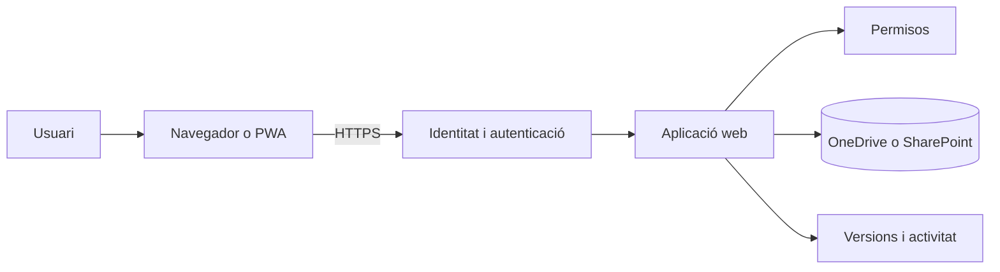

---
hide:
  - navigation
---
# 1. Fonaments de l’ofimàtica web

## Què és l’ofimàtica web?

L’**ofimàtica** és el conjunt d’eines que permeten crear, tractar, organitzar, compartir i presentar informació en una oficina o equip de treball. Inclou documents, dades, presentacions, formularis i espais on guardar els fitxers.

Una aplicació d’**ofimàtica web** s’executa principalment en un servidor i s’utilitza des d’un navegador. La persona usuària no ha d’instal·lar tot el programa en cada ordinador: inicia sessió, obri l’aplicació i treballa amb els fitxers que té autoritzats.

| Necessitat | Aplicació habitual de Microsoft 365 | Resultat |
|---|---|---|
| Redactar i revisar informació | Word | Informe, acta o manual |
| Organitzar dades i calcular | Excel | Pressupost, inventari o gràfic |
| Comunicar una idea visualment | PowerPoint | Presentació d’un projecte |
| Recollir dades estructurades | Forms | Enquesta o inscripció |
| Guardar i ordenar fitxers | OneDrive | Carpetes i documents del projecte |
| Compartir i coordinar un equip | Teams o SharePoint | Espai de treball i recursos compartits |

La utilitat d’una aplicació no depén només del seu nom. Cal relacionar la necessitat amb l’eina, el tipus de dades, les persones que hi participaran i els permisos que necessitaran.

## Per a què serveix en una organització?

L’ofimàtica web és útil quan una organització necessita:

- accedir als documents des de diversos dispositius autoritzats;
- evitar còpies diferents enviades com a fitxers adjunts;
- treballar sobre una versió compartida i actualitzada;
- centralitzar carpetes, permisos i comptes;
- recuperar una versió anterior després d’una errada;
- recollir informació amb formularis i convertir-la en dades analitzables;
- combinar aplicacions en un flux de treball, per exemple `Forms → Excel → PowerPoint`.

En la **Activitat 1. Dissenyem una oficina al núvol** aplicaràs aquesta relació entre necessitat i aplicació i crearàs documents, dades i presentacions per a un mateix projecte. En les activitats següents compartiràs els recursos i treballaràs amb formularis.

## Aplicació d’escriptori, aplicació web i PWA

No hem de confondre tres formes d’utilitzar una eina:

| Modalitat | On s’executa? | Exemple | Responsabilitat principal |
|---|---|---|---|
| Aplicació d’escriptori | En l’ordinador | Word instal·lat | La persona o l’organització instal·la i actualitza el programa |
| Aplicació web | En el servei, dins del navegador | Word Online | El proveïdor manté el servei; l’organització gestiona comptes i dades |
| PWA o aplicació web instal·lada | En el servei, amb una finestra i accés propi | Accés instal·lat a Word web | El navegador crea l’accés; el servei continua sent web |

Una PWA no converteix l’aplicació web en un servidor local ni elimina la necessitat de connexió. Facilita l’accés i pot aparéixer com una aplicació del sistema, però els documents, la identitat i els permisos continuen depenent del servei web.

| Aspecte | Escriptori | Web o PWA |
|---|---|---|
| Instal·lació | Programa complet en cada equip | Accés al servei; la PWA és una instal·lació lleugera |
| Actualitzacions | Cal aplicar-les als clients | Les gestiona principalment el proveïdor |
| Accés | Pot funcionar sense xarxa en moltes tasques | Normalment necessita connexió i sessió |
| Fitxers | Poden quedar en el disc local | Es guarden al servei, com OneDrive, si així ho triem |
| Col·laboració | Cal combinar fitxers o serveis | Coedició, comentaris i versions integrats |

En la **Activitat 1. Dissenyem una oficina al núvol** comprovaràs aquesta diferència i instal·laràs l’accés PWA si el navegador i el compte ho permeten.

## Arquitectura bàsica d’una aplicació web

Quan una persona obri un document, de manera simplificada ocorre el següent:

1. El navegador estableix una connexió segura amb el servei.
2. Microsoft 365 comprova la identitat i crea una sessió.
3. L’aplicació consulta si el compte pot veure, comentar o editar el recurs.
4. El servei recupera el document i envia al navegador l’editor i les dades necessàries.
5. Les modificacions es guarden i, si hi ha més persones, es coordinen amb les altres sessions.

El navegador presenta la interfície, però la identitat, els permisos, els fitxers i l’historial es controlen al costat del servei. Per això una incidència de contrasenya o de permisos pot ser tan important com una incidència de l’aplicació.

## Avantatges i riscos

### Avantatges

- **Accés des de diferents dispositius:** el treball no queda lligat a un únic ordinador.
- **Centralització:** els documents, els comptes i les polítiques es poden administrar des d’un lloc.
- **Col·laboració:** diverses persones poden treballar sobre el mateix recurs.
- **Historial de versions:** és possible consultar o recuperar estats anteriors.
- **Integració:** Forms, Excel, Word i PowerPoint poden formar un mateix flux.
- **Administració centralitzada:** els permisos i els accessos es poden revisar sense visitar cada ordinador.

### Riscos

- **Dependència de la xarxa:** una incidència de connectivitat pot impedir l’accés.
- **Compte compromés:** una contrasenya robada pot donar accés a molts documents.
- **Compartició excessiva:** un enllaç públic pot exposar informació sensible.
- **Dependència del proveïdor:** les funcions i els límits depenen del pla contractat.
- **Confusió de còpies:** descarregar i tornar a pujar fitxers pot crear versions desconnectades de l’original.

!!! question "Pensa"
    Una companya et demana que li envies per correu el pressupost perquè el puga modificar. Quins problemes evitaries compartint el fitxer d’Excel des d’OneDrive amb el permís adequat?

## Criteris d’avaluació treballats

- **RA4.a:** establir la utilitat de les aplicacions d’ofimàtica web a partir de necessitats professionals.
- **RA4.b:** distingir processadors de textos, fulls de càlcul, presentacions, formularis i espais d’emmagatzematge.
