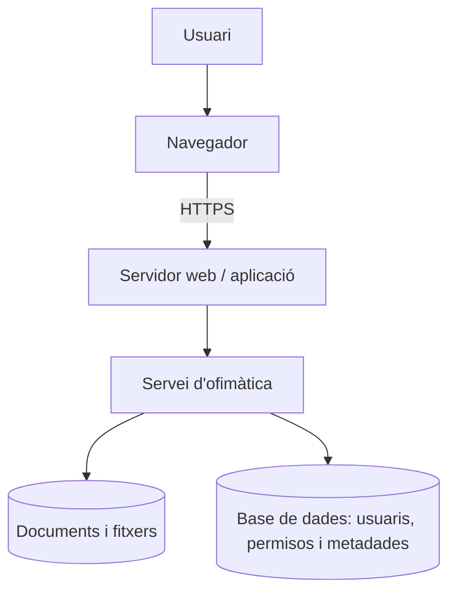

# 1. Fonaments de l’ofimàtica web

## Què és l’ofimàtica?

L’**ofimàtica** és el conjunt d’eines que ajuden a crear, tractar, organitzar i compartir informació en una oficina o equip de treball. No és només escriure textos: inclou documents, dades, presentacions, formularis i fluxos de treball.

| Tipus d’eina | Ús habitual | Exemple de resultat |
|---|---|---|
| Processador de textos | Redactar i revisar informació | Informe, acta o pressupost |
| Full de càlcul | Organitzar dades i fer càlculs | Pressupost, inventari o gràfic |
| Presentacions | Comunicar una idea visualment | Presentació d’un projecte |
| Formularis | Recollir dades estructurades | Enquesta o incidència |
| Notes i tasques | Capturar informació i seguiment | Llista d’accions |
| PDF i diagrames | Distribuir o representar informació | Manual o esquema de procés |

Una suite d’ofimàtica sol integrar diverses d’aquestes eines i un espai per guardar els fitxers.

## Aplicació d’escriptori i aplicació web

Una aplicació d’escriptori s’instal·la i s’executa principalment en l’ordinador de la persona usuària. Una aplicació web s’executa en un servidor i s’utilitza des d’un navegador. En la pràctica hi ha solucions híbrides: una suite web pot oferir també una aplicació local de sincronització o una versió instal·lable.

| Aspecte | Escriptori | Web |
|---|---|---|
| Instal·lació | En cada ordinador; cal mantindre versions | Al servidor o al proveïdor; el navegador accedeix al servei |
| Accés | Normalment des de l’equip on està instal·lada | Des de qualsevol dispositiu autoritzat amb navegador |
| Dades | Disc local, servidor de fitxers o sincronització | Emmagatzematge remot, segons el servei |
| Actualitzacions | Poden requerir intervenció en molts equips | Es centralitzen al servei, però cal revisar-les |
| Xarxa | Pot funcionar sense connexió en moltes tasques | Necessita connexió, encara que algunes ofereixen mode fora de línia |
| Compatibilitat | Depén del sistema operatiu i de la versió | Depén del navegador, els formats i el servidor |
| Col·laboració | Cal intercanviar fitxers o afegir serveis | Compartició, comentaris i edició simultània són funcions naturals |
| Administració | Configuració repetida en cada client | Comptes, permisos i polítiques centralitzades |

La comparació no significa que una opció siga sempre millor. En una empresa amb documents sensibles pot ser important controlar la ubicació de les dades; en un equip mòbil pot pesar més l’accés des de diversos dispositius.

## Arquitectura bàsica

Quan una persona obri un document, de manera simplificada ocorre el següent:

1. El navegador resol l’adreça del servei i inicia una connexió, preferiblement amb **HTTPS**.
2. El servidor comprova la sessió. Si no existeix, demana autenticació.
3. L’aplicació consulta si l’usuari pot veure o editar el document.
4. El servidor recupera el document i envia al navegador el codi de l’editor i les dades necessàries.
5. Les modificacions es transmeten al servei i es guarden. En una edició compartida, el servei coordina les modificacions de les diferents sessions.

El navegador presenta la interfície, però la identitat, els permisos i l’emmagatzematge han d’estar controlats al costat del servidor.

## Avantatges

- **Accés des de diferents dispositius:** l’equip no queda lligat a un únic ordinador.
- **Centralització:** els documents, els comptes i les polítiques es poden administrar des d’un lloc.
- **Col·laboració:** diverses persones poden treballar sobre el mateix recurs.
- **Historial de versions:** és possible consultar o recuperar estats anteriors.
- **Administració centralitzada:** les actualitzacions i els permisos no s’han de repetir en cada client.
- **Còpies de seguretat planificables:** l’organització pot definir què copia, quan i durant quant de temps.
- **Menor dependència del client:** el navegador necessita menys instal·lació específica.

## Inconvenients i riscos

- **Dependència de la xarxa:** una incidència de connectivitat pot impedir l’accés.
- **Dependència del servidor:** una fallada, una actualització incorrecta o falta de recursos afecta moltes persones.
- **Privacitat:** en un SaaS cal conéixer les condicions del proveïdor i la ubicació de les dades.
- **Disponibilitat:** cal revisar els compromisos del servei i tindre un pla per a incidències.
- **Seguretat:** un compte compromés pot donar accés a molts documents.
- **Cost:** el servei pot requerir subscripcions, manteniment o infraestructura pròpia.

!!! question "Pensa"
    Què passaria si una persona guardara l’única còpia d’un document important en el seu portàtil i aquest es perdera? Quines funcions de l’ofimàtica web reduirien el risc?

## Imatge suggerida

<!-- IMATGE SUGGERIDA:
Esquema d’un usuari amb navegador connectant-se per HTTPS a un servidor d’ofimàtica i al seu emmagatzematge.
-->

## Criteris treballats

- RA4.a
