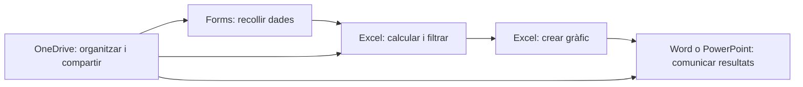

---
hide:
  - navigation
---
# 2. Solucions i aplicacions d’ofimàtica web

No hi ha una única suite adequada per a tots els casos. En aquesta unitat treballarem principalment amb **Microsoft 365**, perquè és l’entorn disponible amb el compte educatiu, però també aprendrem a comparar-lo amb Google Workspace i amb una solució autoallotjada.

La comparació no consisteix a copiar una llista de funcions. Consisteix a relacionar una necessitat amb una aplicació, valorar les dades i els permisos i comprovar si l’entorn permet treballar de manera segura.

## L’ecosistema Microsoft 365

Microsoft 365 és un ecosistema d’aplicacions web i serveis. Les funcions exactes depenen del compte i del pla, però el model de treball és el mateix: una identitat dona accés a diferents eines que comparteixen fitxers, permisos i informació.

| Aplicació | Funció principal | Exemple per a la UP2 |
|---|---|---|
| **Word Online** | Documents de text, estils, taules i revisió | Informe de la jornada o pla de treball |
| **Excel Online** | Dades, fórmules, filtres i gràfics | Pressupost i anàlisi d’inscripcions |
| **PowerPoint Online** | Presentacions i comunicació visual | Presentar el pressupost i les conclusions |
| **OneDrive** | Emmagatzematge, carpetes i compartició | Carpeta `Projecte_Jornada` |
| **Forms** | Formularis i recollida estructurada de dades | Inscripció a una jornada |
| **Teams o SharePoint** | Espai d’equip, documents i coordinació | Projecte compartit amb rols |

Una eina no substitueix automàticament les altres. La competència consisteix a saber quan convé usar-les juntes:

En la **Activitat 1. Descobrim Microsoft 365** identificaràs aquestes aplicacions. En la **Activitat 2** les utilitzaràs per a crear un projecte complet i en la **Activitat 4** construiràs el flux Forms–Excel–Word o PowerPoint.

## Prestacions específiques

### Processador de textos: Word

Word serveix per redactar informació estructurada. Les prestacions que has de saber reconéixer són:

- títols i subtítols amb **estils**;
- índex automàtic basat en els estils;
- taules, imatges i text alternatiu;
- enllaços, capçaleres i peus de pàgina;
- comentaris i, quan estiga disponible, control de canvis;
- historial de versions i recuperació;
- compartició amb lectura, comentari o edició.

Aplicar estils no és només una qüestió estètica: crea una estructura que facilita la navegació, l’accessibilitat i l’actualització de l’índex.

### Full de càlcul: Excel

Excel permet convertir dades en informació útil. En aquesta unitat treballarem:

- dades organitzades en files i columnes;
- fórmules de suma, percentatges i condicions;
- taules i filtres;
- format condicional per destacar valors;
- gràfics adequats al tipus de dada;
- historial de versions i treball compartit.

En un pressupost, per exemple, el total d’una línia pot calcular-se amb `quantitat × preu unitari`; el total general pot sumar les línies; i una condició pot indicar si s’ha superat el límit. No cal memoritzar una fórmula concreta si saps explicar quines cel·les intervenen i quin resultat esperes.

Quan hi ha diverses persones editant, convé acordar qui modifica les fórmules i qui introdueix dades. També és important revisar que el gràfic utilitza el rang correcte i no una còpia antiga.

### Presentacions: PowerPoint

PowerPoint serveix per comunicar una idea, no per convertir cada diapositiva en una pàgina d’un informe. Les prestacions principals són:

- plantilles i temes coherents;
- jerarquia visual amb títols i textos breus;
- imatges, taules i gràfics;
- notes per a la persona que presenta;
- comentaris i revisió;
- compartició i historial de versions.

En la **Activitat 2** incorporaràs a PowerPoint el gràfic creat en Excel. Això permet comprovar que una dada es pot calcular en un full i comunicar en una presentació sense tornar-la a copiar manualment.

### Emmagatzematge i formularis

OneDrive aporta l’espai de treball: carpetes, noms, ubicacions, compartició i versions. Forms aporta una entrada ordenada de dades. Quan les respostes s’obrin en Excel, cal revisar:

1. si les preguntes han produït columnes comprensibles;
2. si hi ha respostes buides o incoherents;
3. quin filtre o càlcul respon a la pregunta professional;
4. si el gràfic representa realment les dades.

## SaaS i autoallotjament

### SaaS

En un model **SaaS** (*Software as a Service*), el proveïdor gestiona la infraestructura i bona part de les actualitzacions. L’organització continua sent responsable dels comptes, els permisos, les dades que comparteix i la formació de les persones usuàries.

Microsoft 365 i Google Workspace són exemples de suites SaaS. En aquest model, l’alumnat no desplega el servidor: configura l’accés i utilitza les aplicacions disponibles.

### Autoallotjament

En l’autoallotjament, l’organització proporciona el servidor o la màquina virtual i instal·la la solució, com podria passar amb Nextcloud integrat amb ONLYOFFICE o Collabora. Té més control sobre la infraestructura, però assumeix també:

- actualitzacions i vulnerabilitats;
- còpies de seguretat i restauració;
- disponibilitat, recursos i xarxa;
- autenticació, permisos i HTTPS;
- suport a les persones usuàries.

Per això una solució autoallotjada no és automàticament més segura. Pot ser adequada quan el control físic de les dades és un requisit i hi ha personal per administrar-la.

## Comparació professional

En la **Activitat 1** faràs una mini comparació amb només aquests cinc criteris:

| Criteri | Microsoft 365 | Google Workspace | Solució autoallotjada |
|---|---|---|---|
| Aplicacions i formats | Word, Excel, PowerPoint i integració amb formats Office | Docs, Sheets i Slides, amb formats propis i importació/exportació | Depén de l’editor i la plataforma triats |
| Col·laboració | Coedició, comentaris, versions i espais compartits | Funcions equivalents dins de Drive | Depén de la plataforma i la configuració |
| Gestió d’usuaris | Identitat i administració centralitzades | Domini i administració centralitzats | Responsabilitat de l’organització |
| Control de les dades | Condicions del proveïdor i del pla | Condicions del proveïdor i del pla | Més control físic, més responsabilitats |
| Infraestructura | Principalment del proveïdor | Principalment del proveïdor | Servidor, xarxa, còpies i manteniment propis |

La decisió ha d’explicar el context. Per a una empresa que ja utilitza comptes Microsoft, la integració pot pesar molt; per a una organització amb requisit de control físic, pot pesar més l’autoallotjament; per a un equip que prioritza la coedició ràpida, cal provar les eines amb documents reals.

## Criteris d’avaluació treballats

- **RA4.b:** descriure processadors de textos, fulls de càlcul, presentacions, formularis i espais d’emmagatzematge.
- **RA4.f:** reconéixer les prestacions específiques de Word, Excel, PowerPoint, OneDrive i Forms.
