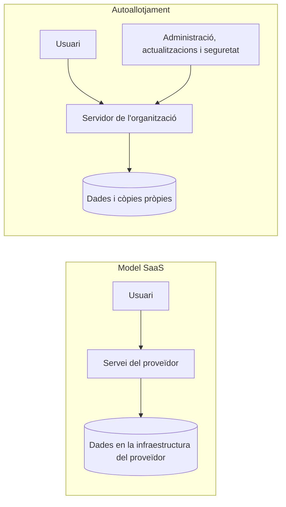

---
hide:
  - navigation
---
# 2. Solucions d’ofimàtica web

No hi ha una única suite adequada per a tots els casos. La decisió depén dels comptes que ja té l’organització, dels formats, del pressupost, de les necessitats de privacitat i de qui administrarà el servei.

## Què hem de comparar?

Abans de triar una solució, convertim la necessitat en criteris observables:

- **Cost:** llicències, emmagatzematge, suport i infraestructura.
- **Privacitat:** qui tracta les dades, on s’allotgen i quines polítiques pot aplicar l’organització.
- **Compatibilitat:** navegadors, sistemes operatius, dispositius mòbils i accessibilitat.
- **Formats:** especialment DOCX, XLSX, PPTX, ODT, PDF i exportacions.
- **Administració:** comptes, grups, rols, auditories, recuperació i polítiques.
- **Col·laboració:** edició simultània, comentaris, control de canvis i versions.
- **Integració:** identitat, correu, calendari, emmagatzematge, intranet o LMS.
- **Autoallotjament:** possibilitat de controlar el servidor i les dades.
- **Infraestructura:** CPU, memòria, disc, còpies i coneixements necessaris.

## Solucions representatives

### Microsoft 365

És una oferta **SaaS** de Microsoft que integra aplicacions com Word, Excel, PowerPoint, OneDrive, SharePoint, Teams i serveis d’administració. Les funcions exactes depenen del pla contractat.

- **Col·laboració:** coedició, comentaris, historial i espais de SharePoint o OneDrive.
- **Usuaris:** gestió centralitzada de comptes, grups i rols mitjançant el centre d’administració i la identitat de Microsoft.
- **Punts forts:** integració amb formats d’Office i amb organitzacions que ja utilitzen comptes Microsoft.
- **Limitacions:** cost recurrent, dependència del proveïdor i diferències entre plans.
- **Autoallotjament:** la suite SaaS no s’instal·la com una còpia completa en un servidor propi; sí que existeixen aplicacions d’escriptori i opcions d’integració.

### Google Workspace

És una suite **SaaS** que inclou Docs, Sheets, Slides, Drive, Forms, Meet i eines d’administració. Els documents nadius de Google no són exactament fitxers DOCX o XLSX, encara que es poden importar i exportar.

- **Col·laboració:** edició simultània, comentaris, suggeriments i historial de versions.
- **Usuaris:** domini, grups, unitats organitzatives i rols d’administrador.
- **Punts forts:** col·laboració ràpida des del navegador i integració amb Drive.
- **Limitacions:** dependència de l’ecosistema i possibles diferències de format en convertir documents.
- **Autoallotjament:** no és la modalitat d’ús de Google Workspace; caldria valorar una solució diferent si el requisit és controlar físicament el servidor.

### ONLYOFFICE

ONLYOFFICE Docs proporciona editors web per a documents de text, fulls de càlcul, presentacions i PDF, amb compatibilitat especialment orientada als formats Office Open XML. Es pot usar integrat amb una plataforma de documents o amb solucions de sincronització i compartició.

- **Col·laboració:** coedició, comentaris, revisió i versions segons la plataforma que l’integra.
- **Usuaris:** poden dependre de l’espai integrat, com ONLYOFFICE Workspace, DocSpace o Nextcloud.
- **Punts forts:** compatibilitat amb DOCX, XLSX i PPTX i possibilitat d’autoallotjament.
- **Limitacions:** el servidor d’editors no és, per si sol, tota una plataforma d’usuaris i fitxers; el desplegament propi exigeix actualitzacions, còpies i administració.
- **Infraestructura:** cal reservar recursos del servidor. Com a referència didàctica, la documentació oficial indica 4 GB de RAM i 40 GB lliures com a base per a l’edició en Docker, a més de recursos per al sistema.

### Collabora Online

Collabora Online ofereix editors web basats en LibreOffice i se sol integrar amb plataformes com Nextcloud. CODE és l’edició comunitària orientada a proves, desenvolupament i entorns on corresponga la seua llicència.

- **Col·laboració:** edició simultània, comentaris i funcions d’edició segons la integració.
- **Usuaris:** normalment els gestiona la plataforma que proporciona els fitxers i l’autenticació.
- **Punts forts:** ecosistema LibreOffice, formats oberts i integracions amb núvol privat.
- **Limitacions:** la compatibilitat amb documents complexos pot variar; cal revisar la versió i el suport requerit.
- **Autoallotjament:** possible, però l’organització assumeix el manteniment del servidor i de la integració.

### El paper de Nextcloud

Nextcloud és sobretot una plataforma d’emmagatzematge, sincronització, compartició i aplicacions. Pot integrar editors com ONLYOFFICE o Collabora. Per tant, no s’ha de confondre la plataforma de fitxers amb l’editor de documents: una aporta identitat, carpetes i permisos, i l’altra edita el contingut.

## Comparativa professional

| Criteri | Microsoft 365 | Google Workspace | ONLYOFFICE autoallotjat | Collabora + plataforma pròpia |
|---|---|---|---|---|
| Cost | Subscripció per pla i usuari | Subscripció per pla i usuari | Llicència/servei segons edició + servidor | Llicència/servei segons edició + servidor |
| Privacitat i dades | Gestionades pel proveïdor segons contracte i regió | Gestionades pel proveïdor segons contracte i regió | Control de la infraestructura pròpia | Control de la infraestructura pròpia |
| Formats | Molt fort en formats Office | Formats natius i importació/exportació | Molt orientat a DOCX/XLSX/PPTX | Bona relació amb formats oberts i Office |
| Administració | Completa i centralitzada | Completa i centralitzada | La decideix la plataforma integradora | La decideix la plataforma integradora |
| Col·laboració | Molt integrada | Molt integrada | Depén de Docs i de l’espai integrat | Depén de CODE i de la plataforma |
| Integracions | Ecosistema Microsoft | Ecosistema Google | Nextcloud, Workspace i altres | Nextcloud i altres integracions |
| Autoallotjament | No és la modalitat principal | No és la modalitat principal | Sí | Sí |
| Infraestructura pròpia | Baixa | Baixa | Mitjana/alta | Mitjana/alta |

La taula no substitueix una prova amb documents reals. Un centre hauria de provar, per exemple, una plantilla amb taules, un full amb fórmules i una presentació amb imatges abans de decidir.

## SaaS i autoallotjament

### SaaS

En un model **SaaS** (*Software as a Service*), el proveïdor gestiona la infraestructura, la plataforma i bona part de les actualitzacions. L’organització configura usuaris, permisos i dades des d’un panell web.

**Avantatges:** posada en marxa ràpida, escalabilitat i menys manteniment físic.

**Responsabilitats que continuen existint:** gestionar comptes, protegir l’accés, revisar comparticions, formar les persones usuàries i comprovar que les còpies i la retenció compleixen la necessitat.

### Autoallotjament

En l’autoallotjament, l’organització proporciona el servidor o la màquina virtual i instal·la la solució. Té més control sobre dades, xarxa i actualitzacions, però també més responsabilitats.

| Pregunta | SaaS | Autoallotjament |
|---|---|---|
| Qui manté el maquinari? | Proveïdor | Organització o servei contractat |
| Qui actualitza la plataforma? | Principalment el proveïdor | Administració pròpia |
| Qui ha de protegir els comptes? | Organització, amb eines del proveïdor | Organització |
| Qui ha de fer còpies? | Cal verificar què cobreix el servei | Organització, explícitament |
| On es pot provar? | Compte o entorn del proveïdor | Màquina virtual o servidor de laboratori |

!!! warning "No confongues control amb absència de feina"
    Autoallotjar una aplicació no fa que les dades siguen automàticament segures. Sense actualitzacions, còpies, HTTPS i una bona gestió de permisos, el control del servidor pot convertir-se en un risc.

## Prestacions específiques

### Processador de textos

Treballa amb paràgrafs, estils, capçaleres, taules, imatges, enllaços i exportació a PDF. Les funcions professionals més importants són els comentaris, el control de canvis, la comparació de versions i el treball amb plantilles.

### Full de càlcul

Permet introduir dades, fórmules i funcions; ordenar i filtrar registres; aplicar format condicional i generar gràfics. En col·laboració cal acordar qui modifica les fórmules i protegir, quan siga possible, les cel·les o fulls sensibles.

### Presentacions

Organitza diapositives amb plantilles, text, imatges, taules, gràfics i elements multimèdia. La col·laboració és útil per separar guió, disseny i revisió, però convé establir una persona responsable de la versió final.

### Altres eines

Els formularis recullen dades estructurades; els editors de PDF permeten anotar o emplenar documents; les notes faciliten la captura ràpida; i els diagrames representen processos o arquitectura.

## Enllaços oficials

- [ONLYOFFICE Docs: instal·lació amb Docker](https://helpcenter.onlyoffice.com/docs/installation/docs-community-install-docker.aspx)
- [Requisits de ONLYOFFICE Docs en Docker](https://helpcenter.onlyoffice.com/docs/installation/docs-community-sys-reqs-docker.aspx)
- [Google Workspace: unitats compartides](https://support.google.com/a/users/answer/7212025)
- [Documentació de Collabora Online](https://sdk.collaboraonline.com/)

## Criteris treballats

- RA4.b
- RA4.f
