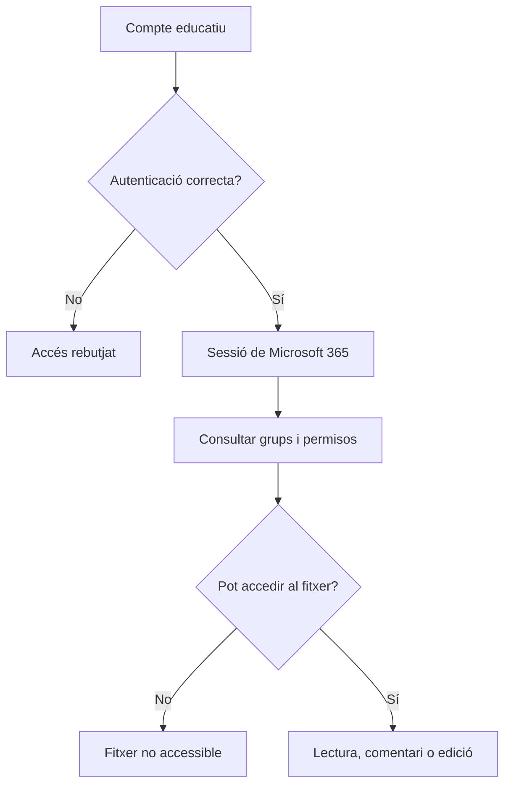

---
hide:
  - navigation
---
# 4. Usuaris, permisos i seguretat

Una aplicació d’ofimàtica web no és només un editor. També és un sistema que decideix qui pot entrar, quins fitxers pot veure, quines accions pot fer i durant quant de temps.

En Microsoft 365, aquesta gestió combina la identitat del compte educatiu, els grups o equips, les carpetes d’OneDrive o SharePoint i els permisos assignats a cada recurs.

## Identitat, autenticació i autorització

- **Compte d’usuari:** identitat digital d’una persona dins de l’organització.
- **Autenticació:** procés de demostrar **qui eres**, per exemple amb contrasenya i MFA.
- **Sessió:** accés temporal que el servei manté després d’autenticar-te.
- **Autorització:** decisió sobre **què pots fer** una vegada autenticat.
- **Grup o equip:** conjunt de persones al qual es poden aplicar recursos i permisos.
- **Rol:** conjunt de capacitats, com responsable, editor o revisor.
- **Permís:** acció concreta sobre un recurs, com llegir, comentar, editar o compartir.

Autenticar una persona no li dona accés a tots els documents. El servei ha de comprovar també l’autorització del compte sobre cada recurs.

## Rols per al projecte

En la **Activitat 3. Projecte col·laboratiu amb Microsoft 365** treballaràs amb tres rols:

| Rol | Pot fer | No hauria de fer per defecte |
|---|---|---|
| Responsable del projecte | Organitzar carpetes, compartir i revisar permisos | Donar edició a totes les persones sense comprovar la necessitat |
| Editor | Modificar els documents assignats | Canviar la compartició de tot el projecte |
| Revisor | Llegir i comentar | Editar el contingut final si no està autoritzat |

La plataforma pot mostrar noms diferents, com **pot editar**, **pot visualitzar**, **pot comentar** o **pot compartir**. El que importa és comprovar la capacitat real amb una prova.

## Cicle de vida d’un compte i d’un accés

1. **Alta:** crear o incorporar el compte i assignar-lo al projecte.
2. **Assignació:** donar només els grups i permisos necessaris.
3. **Ús:** revisar que l’accés funciona i que la persona pot fer la seua tasca.
4. **Canvi de funció:** retirar permisos antics abans d’afegir-ne de nous.
5. **Revocació:** eliminar l’accés quan la persona deixa el projecte.
6. **Revisió:** comprovar periòdicament enllaços, convidats, comptes inactius i persones amb edició.

Retirar una persona d’un grup no sempre elimina tots els accessos: pot tindre un enllaç directe o accés heretat d’una altra carpeta. Per això cal provar l’accés final i no limitar-se a mirar una única pantalla.

## Permisos sobre documents

| Permís | Significat | Ús recomanat |
|---|---|---|
| Visualitzar | Obrir i consultar | Document de referència o resultat final |
| Comentar | Llegir i afegir observacions | Revisió sense editar el text |
| Editar | Modificar el contingut | Persona que fa part del treball |
| Compartir | Convidar altres persones o canviar l’accés | Responsable limitat del projecte |
| Descarregar | Crear una còpia fora de l’espai web | Només si la política ho permet |

### Principi de mínim privilegi

Cada compte ha de tindre únicament els permisos necessaris per a la seua tasca i durant el temps necessari. És més segur començar amb **visualitzar** i ampliar a **comentar** o **editar** quan cal que donar edició a tothom.

La matriu de l’activitat permet convertir aquest principi en una prova:

| Recurs | Responsable | Editor | Revisor |
|---|---|---|---|
| Pla de treball | Editar i compartir | Editar | Visualitzar i comentar |
| Full de tasques | Editar i compartir | Editar | Visualitzar |
| Presentació | Editar i compartir | Editar | Visualitzar |
| Carpeta privada de proves | Accés | Sense accés | Sense accés |

## Compartició i enllaços

Ordenats de més restrictiu a més obert:

1. **Persones concretes:** opció preferida per a un projecte intern.
2. **Persones de l’organització:** útil quan tot el domini pot consultar el recurs.
3. **Qualsevol persona amb l’enllaç:** pot arribar a ser públic; només s’ha d’usar amb contingut realment públic.

Abans de compartir, respon:

- Qui necessita el document?
- Necessita visualitzar, comentar o editar?
- Pot tornar a compartir-lo?
- Durant quant de temps necessita l’accés?
- Com el retiraré quan finalitze el projecte?

Compartir un document amb una persona no és igual que compartir la carpeta que el conté. Revisa els permisos heretats i els enllaços existents.

## Bones pràctiques de seguretat

### Comptes i autenticació

- Usa el compte educatiu indicat pel centre i no comptes personals.
- No compartisques contrasenyes ni codis de verificació.
- Activa MFA quan el centre ho permeta.
- No mantingues oberta la sessió en un equip compartit.
- No uses un compte administrador per a treballar diàriament amb documents.

### Fitxers i dades

- Utilitza dades fictícies en totes les pràctiques.
- Guarda el fitxer en la carpeta correcta abans de compartir-lo.
- Revisa el permís abans de copiar l’enllaç.
- Tapa correus, noms, tokens i URL sensibles en les captures.
- Comprova l’historial i la recuperació de versions abans de donar per perduda una dada.

### Continuïtat i incidències

- Revisa permisos i enllaços quan canvia el grup.
- Mantín una persona responsable de la versió final.
- Documenta qui ha detectat una incidència i quina correcció s’ha aplicat.
- Separa dades de prova i dades reals.
- No publiques enllaços de la pràctica fora de l’entorn autoritzat.

## Configuracions insegures i correccions

| Configuració insegura | Risc | Correcció |
|---|---|---|
| Document amb enllaç públic d’edició | Qualsevol posseïdor pot canviar-lo | Compartir amb persones concretes i donar el permís mínim |
| Revisor amb permís d’edició | Pot modificar el resultat final | Canviar a visualització o comentari |
| Compte d’una persona que deixa el projecte actiu | Accés no autoritzat | Revocar l’accés i comprovar-lo amb una prova |
| Tots poden compartir la carpeta | Pèrdua de control sobre els destinataris | Limitar la compartició al responsable |
| Captura amb adreces o tokens visibles | Exposició de dades | Tapar la informació abans de lliurar-la |

En la **Activitat 4. Repte Microsoft 365** hauràs de resoldre incidències d’aquest tipus i documentar el símptoma, la causa, l’acció i la comprovació final.

!!! question "Pensa"
    Una persona només ha de revisar la redacció d’un informe. Quin permís triaries: visualització, comentari o edició? Com comprovaries que la decisió és correcta?

## Criteris d’avaluació treballats

- **RA4.d:** gestionar comptes, grups, rols i permisos d’accés.
- **RA4.e:** aplicar el mínim privilegi, compartir amb seguretat i corregir riscos.
