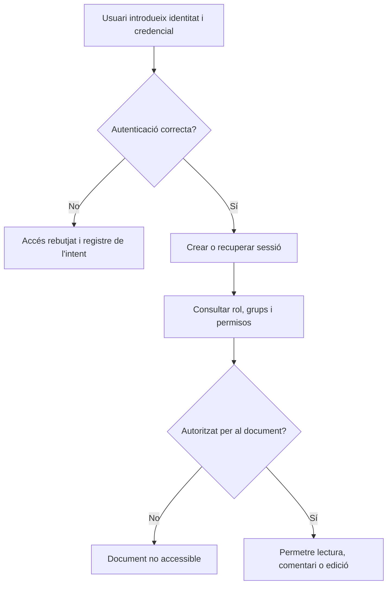

---
hide:
  - navigation
---
# 4. Usuaris, permisos i seguretat

Una aplicació d’ofimàtica web no és només un editor. També és un sistema que decideix qui pot entrar, què pot fer i quins documents pot veure. Una configuració còmoda però massa permissiva pot exposar informació sensible.

## Identitat, autenticació i autorització

- **Compte d’usuari:** representació d’una persona o servei dins de la plataforma.
- **Identitat:** informació que permet reconéixer el compte, com el nom, l’adreça i el grup.
- **Autenticació:** procés de demostrar **qui eres**. Pot usar una contrasenya, un segon factor o un sistema d’identitat corporatiu.
- **Autorització:** decisió sobre **què pots fer** després d’autenticar-te.
- **Grup:** conjunt de comptes al qual es poden aplicar permisos o polítiques.
- **Rol:** conjunt de capacitats, per exemple administrador o editor.
- **Permís:** acció concreta sobre un recurs, com llegir, comentar o editar.

Autenticar una persona no li dona automàticament accés a tots els documents. L’aplicació ha de comprovar també l’autorització en cada recurs.

## Rols habituals

| Rol | Pot fer | No hauria de fer per defecte |
|---|---|---|
| Administrador | Gestionar la plataforma, usuaris i polítiques | Editar tots els documents com a tasca quotidiana |
| Usuari estàndard | Crear i utilitzar els seus recursos | Canviar polítiques globals |
| Editor | Modificar documents que li han compartit | Administrar comptes |
| Revisor o comentarista | Llegir i proposar observacions | Canviar el contingut final si no està autoritzat |
| Lector | Consultar recursos | Editar, compartir o descarregar si està restringit |
| Convidat | Accedir a un recurs concret i temporal | Entrar a tot l’espai de l’organització |

Els noms poden variar entre Microsoft 365, Google Workspace, Nextcloud o ONLYOFFICE. El que importa és traduir el rol a capacitats reals i provar-les.

## Cicle de vida d’un compte

1. **Alta:** crear el compte, assignar grups i comunicar l’accés per un canal segur.
2. **Canvi de funció:** revisar grups i permisos; no acumular permisos antics sense motiu.
3. **Canvi o recuperació de contrasenya:** fer-ho mitjançant el procediment de la plataforma.
4. **Desactivació:** bloquejar l’accés quan la persona deixa temporalment l’organització.
5. **Baixa:** eliminar o conservar el compte segons la política de retenció, transferint abans els recursos necessaris.
6. **Revisió:** comprovar periòdicament comptes inactius, convidats i administradors.

!!! question "Cas realista"
    Una professora canvia de departament. És suficient canviar-li el nom del grup? No necessàriament: cal revisar els grups, les carpetes compartides, els enllaços creats i els documents dels quals era responsable.

## Permisos sobre documents

| Permís | Significat | Ús recomanat |
|---|---|---|
| Lectura | Obrir i consultar | Documents de referència |
| Comentari | Llegir i afegir observacions | Revisió sense editar el text final |
| Edició | Modificar el contingut | Persones que fan part del treball |
| Compartició | Convidar altres persones o canviar accés | Responsables limitats |
| Descàrrega | Copiar el document fora de la plataforma | Només si la política ho permet |
| Administració | Canviar usuaris, grups o configuració global | Personal tècnic autoritzat |

### Principi de mínim privilegi

Cada compte ha de tindre únicament els permisos necessaris per a la seua tasca i durant el temps necessari. És més segur començar amb lectura i ampliar a edició quan cal que donar edició a tothom i intentar corregir-ho després.

## Compartició i enllaços

- **Restringit a persones o grups:** opció preferida per a informació interna.
- **Qualsevol persona de l’organització amb l’enllaç:** útil per a un recurs intern general, si la política ho permet.
- **Qualsevol persona amb l’enllaç:** enllaç potencialment públic; només per a contingut que realment puga ser públic.
- **Caducitat:** redueix el temps d’exposició d’un enllaç temporal.
- **Contrasenya:** capa addicional quan la plataforma l’ofereix; no substitueix la restricció per identitat.
- **Revocació:** elimina un accés que ja no és necessari.

Compartir un document amb una persona concreta és diferent de compartir la carpeta que el conté. Revisa sempre els permisos heretats: un usuari pot rebre accés per un grup encara que no aparega com a convidat directe.

## Bones pràctiques de seguretat

### Contrasenyes i MFA

- Usa contrasenyes llargues i diferents per a cada servei.
- No les envies per correu ni les guardes en un full compartit.
- Utilitza un gestor de contrasenyes aprovat pel centre o l’empresa.
- Activa **MFA** (*autenticació multifactor*) quan estiga disponible, sobretot en comptes administradors.
- Protegeix els codis de recuperació i actualitza els mecanismes de recuperació.

### HTTPS

HTTP envia les peticions sense el xifrat que aporta HTTPS. Amb HTTPS, el navegador valida un certificat i la comunicació viatja xifrada entre el client i el servidor. Això ajuda a evitar que tercers lligen o modifiquen la comunicació, però no corregeix permisos mal configurats ni un compte robat.

### Administració i continuïtat

- Actualitza la plataforma i les integracions.
- Fes còpies de seguretat i prova que es poden restaurar.
- Revisa permisos, enllaços públics i comptes antics.
- Limita el nombre de comptes administradors.
- Consulta el registre d’activitat quan hi haja una incidència.
- Separa l’entorn de proves de les dades reals.

## Configuracions insegures i correccions

| Configuració insegura | Risc | Correcció |
|---|---|---|
| Document sensible amb enllaç públic d’edició | Qualsevol posseïdor de l’enllaç pot canviar-lo | Restringir a comptes o grups i donar lectura/comentari si és suficient |
| Tots els usuaris són administradors | Una errada o compte compromés afecta tota la plataforma | Aplicar rols separats i mínim privilegi |
| Compte d’una persona que ja no treballa actiu | Accés no autoritzat | Desactivar-lo i transferir recursos segons la política |
| Servei només amb HTTP en una xarxa compartida | Intercepció de credencials o dades | Configurar HTTPS amb certificat vàlid |
| Única còpia dins del contenidor | Pèrdua en una fallada o actualització | Muntar emmagatzematge i fer còpies verificades |
| Mateixa contrasenya per a usuaris de laboratori i administració | Una filtració compromet diversos entorns | Comptes individuals i secrets diferents |

!!! warning "Dades de la pràctica"
    Usa noms ficticis i fitxers de prova. Una captura de pantalla pot contindre adreces, tokens o documents sensibles; revisa-la abans de lliurar-la.

## Criteris treballats

- RA4.d
- RA4.e
