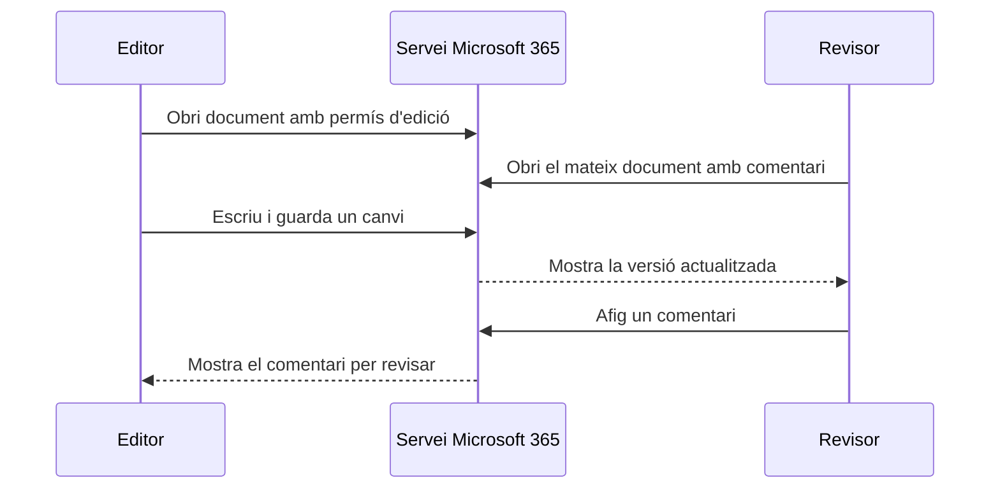
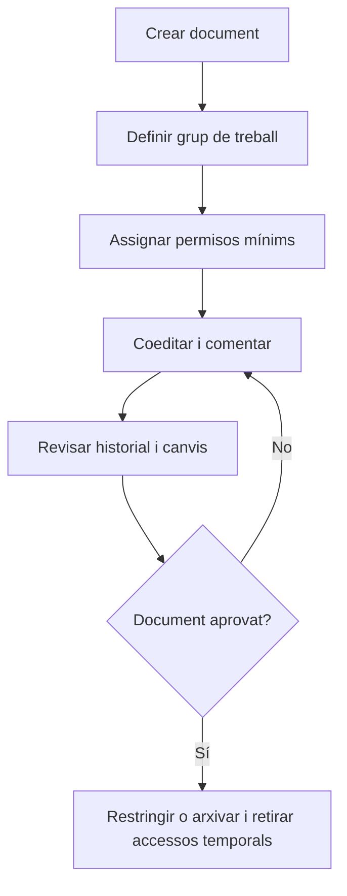

---
hide:
  - navigation
---
# 5. Treball col·laboratiu amb Microsoft 365

Col·laborar és treballar sobre un recurs compartit amb responsabilitats, permisos i una forma de revisió definida. No significa donar edició total a totes les persones ni acumular còpies enviades per correu.

En aquesta UP practicaràs la col·laboració amb Word, Excel, PowerPoint i OneDrive. També veuràs com Forms i Excel poden convertir respostes en informació que després es comunica en un document o una presentació.

## Edició simultània

Quan dues o més sessions obrin el mateix document amb permís d’edició, l’aplicació envia les modificacions al servei i coordina l’estat que veu cada persona. Per treballar amb criteri:

1. obri el mateix recurs des de comptes diferents;
2. comprova qui està connectat;
3. reparteix les parts del document abans d’escriure;
4. evita modificar alhora la mateixa cel·la o paràgraf;
5. espera que els canvis es guarden;
6. comprova el resultat des d’una altra sessió.

La coedició no és una còpia de seguretat. Si algú elimina informació o introdueix un error, cal consultar l’historial i recuperar una versió anterior.



## Comentaris i revisió

Els comentaris permeten separar el contingut del debat sobre el contingut. Un flux professional és:

1. crear un comentari sobre una frase, cel·la o diapositiva;
2. descriure el problema o la proposta amb claredat;
3. mencionar la persona responsable si la plataforma ho permet;
4. respondre el comentari amb una decisió o una pregunta;
5. fer el canvi acordat;
6. resoldre el comentari quan l’acció estiga completada.

En Word, el control de canvis pot mostrar insercions i eliminacions perquè una persona responsable les accepte o rebutge. Els comentaris expliquen una decisió; el control de canvis registra una modificació. No són la mateixa funció.

## Historial de versions

```text
Versió 1 → Versió 2 → Versió 3 → Versió 4
  base       canvis       revisió      final
```

L’historial permet:

- saber quan s’ha produït un canvi;
- identificar, si el servei ho registra, qui l’ha fet;
- comparar estats anteriors;
- recuperar una versió abans d’una errada;
- explicar l’evolució del document.

No és necessari crear una versió manual per cada tecla. És millor marcar moments significatius: `esborrany`, `revisió`, `aprovada` i `final`. Abans de recuperar una versió, guarda o documenta l’estat actual per no perdre informació útil.

## Rols i responsabilitats

| Persona o rol | Permís principal | Responsabilitat |
|---|---|---|
| Responsable del projecte | Edició i compartició controlada | Decideix l’estructura i valida el lliurament |
| Editor | Edició | Redacta o calcula la part assignada |
| Revisor | Comentari o visualització | Detecta errors i proposa millores |
| Lector | Visualització | Consulta i comprova que la informació és comprensible |

En la **Activitat 2. Projecte col·laboratiu amb Microsoft 365**, cada persona haurà d’assumir un rol, provar el seu accés i comprovar què passa quan se li retira un permís.

## Compartició segura per a col·laborar

Abans de compartir, respon:

- Quin document necessita la persona?
- Necessita visualització, comentari o edició?
- Durant quant de temps?
- La compartició és per compte, grup o enllaç?
- Qui pot tornar a compartir-lo?
- Com revocarem l’accés quan acabe el projecte?



## Del formulari a la presentació

La col·laboració no es limita a editar el mateix document. Un equip pot repartir un flux complet:

1. una persona crea el formulari de Forms;
2. l’equip respon i revisa la qualitat de les preguntes;
3. una persona obri les respostes en Excel;
4. l’equip comprova fórmules, filtres i gràfics;
5. una persona prepara l’informe de Word o la presentació de PowerPoint;
6. el revisor deixa comentaris i el responsable valida la versió final.

En la **Activitat 3. Repte Microsoft 365** hauràs de construir aquest flux i explicar les decisions preses. El resultat no és només un gràfic: és una cadena de dades, anàlisi i comunicació amb permisos controlats.

## Evidència d’una col·laboració real

Una bona demostració no és només una captura de la pantalla principal. Ha de mostrar, de forma segura:

1. els participants o comptes de prova;
2. la matriu de permisos;
3. un canvi fet des de més d’un rol;
4. un comentari, una resposta i un comentari resolt;
5. una versió anterior i la recuperació o comparació;
6. la revocació d’un accés temporal;
7. en el repte, el recorregut Forms → Excel → Word o PowerPoint.

!!! question "Pensa"
    Si una persona només ha de revisar la redacció, què és més adequat: donar-li edició completa o comentari? Quina diferència hi ha entre el comentari i la recuperació d’una versió?

## Criteris d’avaluació treballats

- **RA4.f:** reconéixer i utilitzar prestacions específiques de Word, Excel, PowerPoint, OneDrive i Forms.
- **RA4.g:** utilitzar les aplicacions de manera col·laborativa, amb comentaris, versions i responsabilitats repartides.
