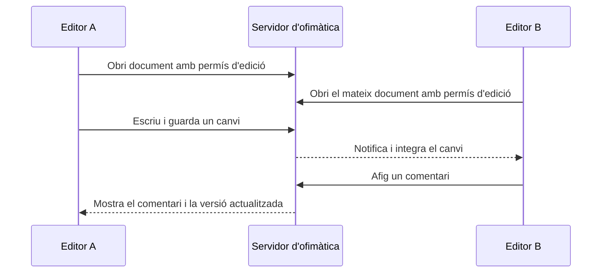
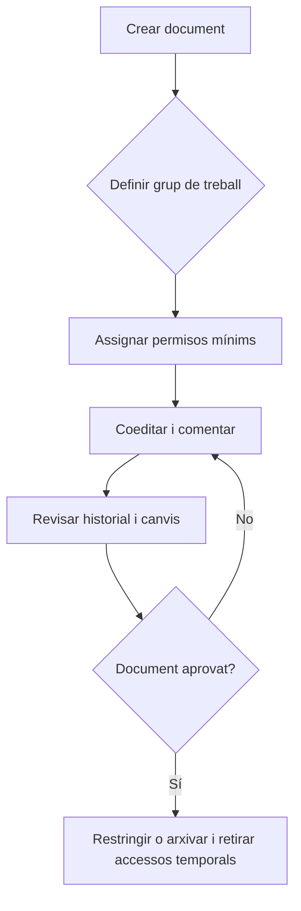

---
hide:
  - navigation
---
# 5. Treball col·laboratiu

Col·laborar és treballar sobre un recurs compartit amb responsabilitats i permisos definits. No significa donar edició total a totes les persones.

## Edició simultània

Quan dues o més sessions obrin el mateix document, l’aplicació envia les modificacions al servidor i coordina l’estat que veu cada persona. Les tècniques internes poden variar, però l’usuari ha de saber:

1. obrir el mateix recurs des de comptes diferents;
2. comprovar qui està connectat;
3. editar zones diferents per evitar conflictes innecessaris;
4. esperar que els canvis es guarden;
5. comprovar el resultat des d’una altra sessió.

La coedició no és una còpia automàtica de seguretat. Cal revisar l’historial i les polítiques de recuperació.



## Comentaris i revisió

Els comentaris permeten separar el text del debat sobre el text. Un flux senzill és:

1. crear un comentari sobre una frase, cel·la o diapositiva;
2. descriure el problema o la proposta amb claredat;
3. mencionar la persona responsable si la plataforma ho permet;
4. respondre el comentari amb una decisió o una pregunta;
5. resoldre’l quan l’acció s’haja completat.

En un processador de textos, el **control de canvis** mostra insercions i eliminacions perquè una persona responsable les accepte o les rebutge. Els comentaris i el control de canvis tenen funcions diferents: un comenta una decisió i l’altre registra canvis en el contingut.

## Historial de versions

```text
Versió 1 → Versió 2 → Versió 3 → Versió 4
  base       canvis       revisió      final
```

L’historial permet:

- saber quan s’ha produït un canvi;
- identificar, si la plataforma ho registra, qui l’ha fet;
- comparar estats anteriors;
- recuperar una versió abans d’una errada;
- explicar l’evolució del document.

No és recomanable crear versions manualment per cada tecla. És millor usar noms o marques en moments significatius: `esborrany`, `revisió`, `aprovada` i `final`.

## Organització d’un equip

| Persona o rol | Permís principal | Responsabilitat |
|---|---|---|
| Responsable del projecte | Edició i compartició controlada | Decideix l’estructura i valida el lliurament |
| Editor | Edició | Redacta o calcula la part assignada |
| Revisor | Comentari o suggeriments | Detecta errors i proposa millores |
| Lector | Lectura | Consulta i valida que la informació és comprensible |

Exemple: en una presentació comercial, el responsable crea el fitxer; dues persones editen diapositives diferents; una tercera revisa el missatge amb comentaris; i la direcció només rep accés de lectura fins a l’aprovació.

## Compartició segura per a col·laborar

Abans de compartir, respon:

- Quin document necessita la persona?
- Necessita lectura, comentari o edició?
- Durant quant de temps?
- La compartició és per compte, grup o enllaç?
- Qui pot tornar a compartir-lo?
- Com revocarem l’accés quan acabe el projecte?



!!! question "Pensa"
    Si una persona només ha de revisar la redacció, què és més adequat: donar-li edició completa o comentari? Quina informació perdríem si només li donàrem lectura?

## Evidència d’una col·laboració real

Una bona demostració no és només una captura de la pantalla principal. Ha de mostrar, de forma segura:

1. els participants o els comptes de prova;
2. la matriu de permisos;
3. un canvi fet des de cada rol;
4. un comentari, una resposta i un comentari resolt;
5. una versió anterior i la recuperació o comparació;
6. la revocació d’un accés temporal.

## Criteris treballats

- RA4.f
- RA4.g
