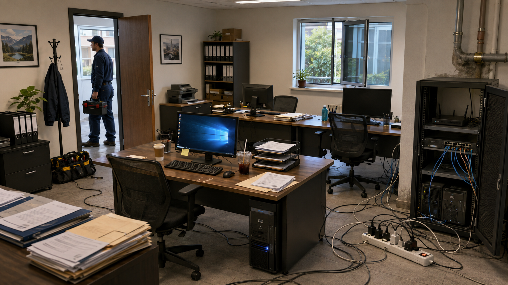

---
hide:
  - navigation
---
# Activitat 1. Informe d’anàlisi de riscos d’una sala de servidors

## Finalitat

Aprendreu a passar de «veig coses malament» a identificar actius, amenaces i vulnerabilitats, valorar riscos i proposar mesures de protecció justificades.

Treballareu principalment els criteris **RA1.a**, **RA1.b**, **RA1.c** i **RA1.d**.

## Organització i duració

- Individual o per parelles, segons indique el professorat.
- **1 hora i 30 minuts** d’anàlisi i planificació, més el temps necessari per redactar l’informe.

## Situació

L’empresa **TecnoGest SL** ha instal·lat recentment una xicoteta sala de servidors des d’on es gestionen diversos serveis interns de l’empresa.

La direcció sospita que la instal·lació presenta alguns problemes de seguretat i vos ha demanat, com a tècnics informàtics, que feu una **primera anàlisi de riscos de la sala**.

Disposeu únicament de la imatge següent:

*Imatge de la instal·lació que heu d’analitzar.*

La vostra faena serà elaborar un **informe tècnic professional** en què expliqueu els problemes detectats, valoreu els riscos i proposeu mesures de millora.

No es tracta simplement de trobar «coses que estan mal». Haureu de **justificar per què representen un risc per als sistemes o per a la informació**.

## Abans de començar

Utilitzeu com a guia el recurs d’INCIBE **Análisis de riesgos en 6 pasos**.

L’objectiu no és copiar el contingut, sinó entendre com es relacionen aquests conceptes:

**Actiu → Amenaça → Vulnerabilitat → Impacte → Risc → Mesura de protecció**

Per exemple:

> **Actiu:** servidor
> **Amenaça:** inundació o fuga d’aigua
> **Vulnerabilitat:** canonada situada al costat dels equips
> **Conseqüència:** avaria dels servidors i interrupció del servei
> **Mesura:** separar les conduccions d’aigua de la sala o protegir els equips davant possibles fugues

## Què heu de fer?

Seguiu aquest procés:

1. **Observeu la sala i identifiqueu els actius importants.** No penseu només en els ordinadors: també poden ser actius els servidors, els equips de xarxa, les dades, el cablejat, l’alimentació elèctrica o els serveis que depenen d’aquests equips.
2. **Identifiqueu els riscos que observeu.** Busqueu situacions relacionades amb accés físic, electricitat, aigua, temperatura, incendi, cablejat, ubicació dels equips i manipulació accidental.
3. **Analitzeu cada risc.** Per a cada problema detectat indiqueu quin actiu està afectat, quina amenaça existeix, quina vulnerabilitat facilita que es produïsca i quines podrien ser les conseqüències.
4. **Valoreu el risc.** Utilitzeu una escala senzilla de probabilitat i impacte: **baix, mitjà o alt**.
5. **Proposeu una solució.** Expliqueu quina mesura aplicaríeu per eliminar el problema o reduir-ne el risc. La mesura ha de ser coherent amb el problema detectat.
6. **Prioritzeu.** Al final de l’informe indiqueu quines serien les **tres actuacions que realitzaríeu primer** si l’empresa tinguera un pressupost limitat.

## Informe que heu d’entregar

El document final haurà de tindre aspecte d’un **informe tècnic**, no d’un qüestionari.

### 1. Portada

Incloeu:

**Informe d’anàlisi de riscos de la sala de servidors**

Nom i cognoms

Mòdul: Seguretat Informàtica

Data

### 2. Objectiu de l’informe

Expliqueu en un paràgraf breu què s’ha analitzat i quina és la finalitat de l’informe.

Per exemple:

> L’objectiu d’aquest informe és analitzar les condicions de seguretat física de la sala de servidors de TecnoGest SL, identificar possibles riscos per als sistemes informàtics i proposar mesures que permeten reduir-los.

### 3. Actius identificats

Incloeu una taula senzilla:

| Actiu | Importància |
| --- | --- |
| Servidors | Allotgen serveis i informació de l’empresa |
| Switch i router | Permeten la comunicació de la xarxa |
| Dades | Informació necessària per al funcionament de l’empresa |
| Alimentació elèctrica | Necessària per mantindre els sistemes disponibles |
| ... | ... |

No és necessari fer un inventari exhaustiu. Identifiqueu els actius que considereu més importants per a l’anàlisi.

### 4. Identificació i anàlisi de riscos

Aquesta serà la part principal de l’informe:

| Nº | Actiu | Amenaça | Vulnerabilitat detectada | Conseqüència | Probabilitat | Impacte | Risc |
| ---: | --- | --- | --- | --- | --- | --- | --- |
| 1 | Servidors | Aigua | Canonada pròxima als equips | Avaria i pèrdua temporal del servei | Mitjana | Alt | Alt |
| 2 |  |  |  |  |  |  |  |
| 3 |  |  |  |  |  |  |  |

No hi ha un nombre exacte de problemes que heu de trobar. **La qualitat de l’anàlisi és més important que la quantitat.**

### 5. Propostes de millora

Per als riscos que heu identificat, proposeu una mesura de protecció:

| Risc detectat | Mesura proposada | Justificació |
| --- | --- | --- |
| Possibles danys per fuga d’aigua | Reubicar el servidor o modificar la conducció | Evita que una fuga puga afectar directament els equips |
|  |  |  |

No és suficient indicar «arreglar-ho» o «millorar la seguretat». Expliqueu **què faríeu concretament**.

### 6. Priorització

Imagineu que l’empresa **no pot solucionar tots els problemes immediatament**.

Seleccioneu les **tres mesures que aplicaríeu primer** i justifiqueu breument per què:

| Prioritat | Actuació | Motiu |
| ---: | --- | --- |
| 1 |  |  |
| 2 |  |  |
| 3 |  |  |

### 7. Conclusions

Finalitzeu amb una valoració breu de l’estat general de la sala.

Podeu respondre qüestions com: **És una sala segura? Quin és el principal problema? Creieu que existeix algun risc que podria arribar a interrompre completament els serveis de l’empresa?**

## Format de lliurament

- **Format:** PDF.
- **Extensió orientativa:** 3–5 pàgines, sense comptar la portada.
- **Treball:** individual.

Es valorarà especialment que els problemes estiguen **ben identificats, justificats i relacionats amb mesures de seguretat adequades**.

!!! tip "Connexió amb la primera observació"
    Si ja havíeu analitzat aquesta imatge de manera informal, compareu aquella primera observació amb l’informe actual. Una frase com «hi ha cables pel terra» ara s’hauria de poder expressar com una vulnerabilitat, una amenaça, un impacte i una mesura concreta.

[Activitat 2. Auditoria física](activitat-2-auditoria-fisica.md) · [Índex de la UT1](../index.md)
